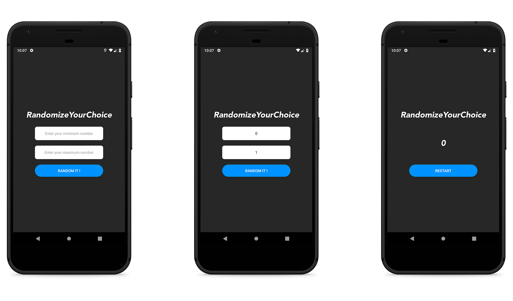

)

# RandomizeYourChoice

RandomizeYourChoice is a little random picker app for Android.

## Download

or

Get the app from the [releases page](https://github.com/Warza31/RandomizeYourChoice/releases).

## Meta
Hugo Courthias – hugo.courthias@gmail.com

Distributed under the MIT license. See ``LICENSE`` for more information.
